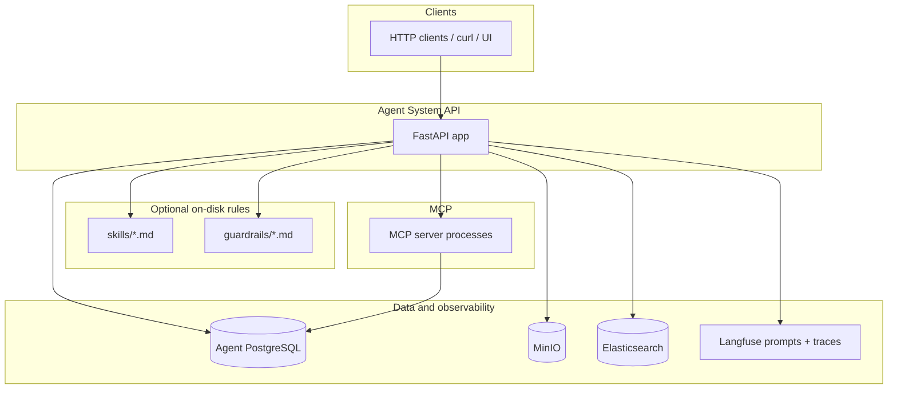
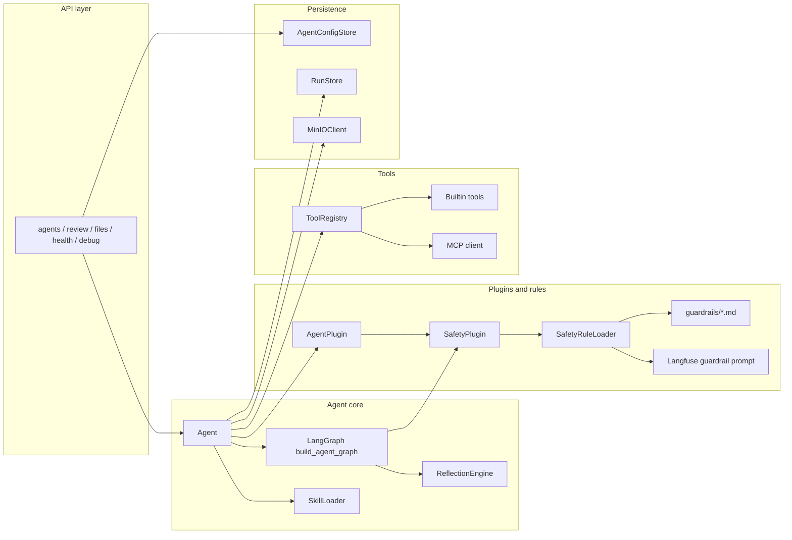
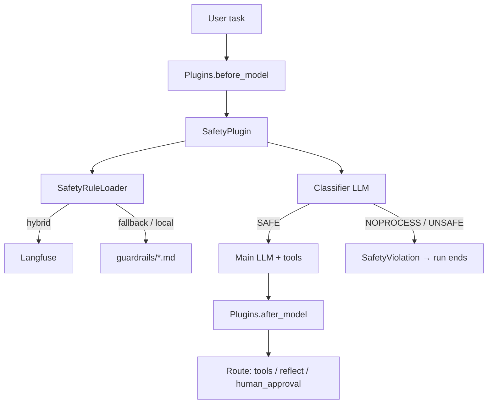
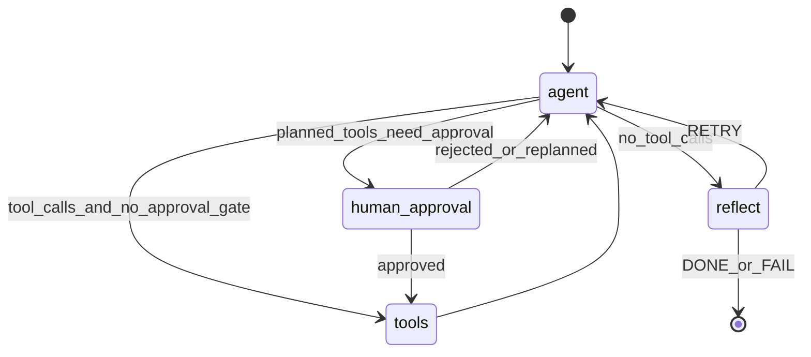
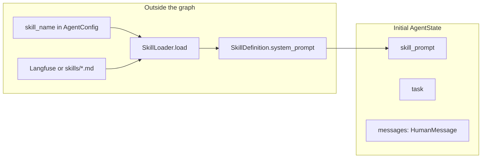
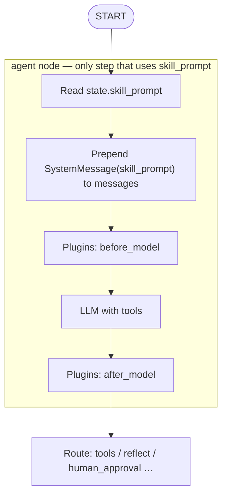

# Logical architecture of the Agent System project

## One-sentence pitch

A **production-oriented agent runtime**: HTTP API creates and caches `Agent` instances; each run executes a **LangGraph** loop (plan/act → tools → reflect → retry or finish), optionally runs **pipeline plugins** (e.g. **SafetyPlugin** with rules loaded from **`guardrails/*.md`** or **Langfuse**, mirroring skills), persists runs and traces to **PostgreSQL** and **MinIO**, and integrates **Langfuse** for LLM observability, **Elasticsearch** for app logs, and optional **MCP** tools (e.g. Postgres).

---

## System context (runtime and infrastructure)

The app is the `app` service in [`docker-compose.yaml`](../docker-compose.yaml). It depends on **agent PostgreSQL** (app metadata, runs, memory), **MinIO** (artifacts and exported traces), **Elasticsearch** (structured logs), and **Langfuse** (trace UI + **prompts** for skills and optional guardrail rules). MCP tools are loaded at startup via subprocesses (e.g. `@modelcontextprotocol/server-postgres` pointed at the same agent DB). **Skills** and **guardrails** can be read from the repo (`./skills`, `./guardrails`) via compose mounts and/or from Langfuse in **hybrid** mode.

---

## Application layering (code organization)

Entry: [`src/agent_system/main.py`](../src/agent_system/main.py) runs Uvicorn with `create_app()` from [`src/agent_system/api/app.py`](../src/agent_system/api/app.py).

**Lifespan** (startup): `asyncpg` pool → ensure `agent_configs` table → ensure **`agent_runs.run_trace`** column (idempotent migration for older DB volumes) → **ToolRegistry** (built-ins + MCP) → **Langfuse** handler → restore agents from DB into an in-memory cache.

| Layer | Role | Key modules |
|--------|------|-------------|
| **API** | Routes, auth (`X-API-Key`), middleware (`X-Request-ID`) | [`api/app.py`](../src/agent_system/api/app.py), [`api/routes/agents.py`](../src/agent_system/api/routes/agents.py), [`api/routes/review.py`](../src/agent_system/api/routes/review.py), [`api/routes/files.py`](../src/agent_system/api/routes/files.py) |
| **Agent core** | `Agent` wires skill, LLM, tools, plugins, compiled graph | [`core/agent.py`](../src/agent_system/core/agent.py), [`core/graph.py`](../src/agent_system/core/graph.py), [`core/reflection.py`](../src/agent_system/core/reflection.py), [`core/skill_loader.py`](../src/agent_system/core/skill_loader.py) |
| **Plugins & guardrails** | `AgentPlugin` hooks; `SafetyPlugin` + rule loader (local / Langfuse / hybrid) | [`core/plugins.py`](../src/agent_system/core/plugins.py), [`core/safety_plugin.py`](../src/agent_system/core/safety_plugin.py), [`core/safety_rule_loader.py`](../src/agent_system/core/safety_rule_loader.py), [`config/settings.py`](../src/agent_system/config/settings.py) (`GuardrailsSettings`) |
| **Models** | LLM factory (OpenRouter / local) | [`models/llm_factory.py`](../src/agent_system/models/llm_factory.py) |
| **Tools** | Built-ins + MCP discovery | [`tools/registry.py`](../src/agent_system/tools/registry.py), [`tools/builtin_tools.py`](../src/agent_system/tools/builtin_tools.py), [`tools/mcp_client.py`](../src/agent_system/tools/mcp_client.py) |
| **Storage** | Config, runs, MinIO | [`storage/agent_config_store.py`](../src/agent_system/storage/agent_config_store.py), [`storage/run_store.py`](../src/agent_system/storage/run_store.py), [`storage/minio_client.py`](../src/agent_system/storage/minio_client.py) |
| **Cross-cutting** | Langfuse callbacks | [`tracing.py`](../src/agent_system/tracing.py) |

Optional **ADK proxies** under [`src/agent_system/adk/`](../src/agent_system/adk/) (`coder_proxy`, `researcher_proxy`, `analyst_proxy`) sit beside the main stack for integration-style agents.

---

## Guardrail and plugin flow (when enabled)

Agents opt in via `AgentConfig.plugins` (e.g. `["safety"]`). **`SafetyPlugin`** runs inside the **`agent`** node **before** the main tool-calling LLM: it loads a rule (`prompt_injection` by default) via **`SafetyRuleLoader`**, runs a **short classifier LLM** call, and may raise **`SafetyViolation`** so the run ends without invoking the main graph step further. Rules follow the same **local / Langfuse / hybrid** pattern as skills (`GUARDRAILS_*` env vars). Missing local rule files in hybrid mode after Langfuse failure **fail closed** (run error, no silent skip).

---

## Execution flow (single run)

Conceptually (from [`core/graph.py`](../src/agent_system/core/graph.py) and `AgentState`):

1. **agent** node: **plugin hooks** (`before_model` / `after_model`); then LLM with tools; may emit tool calls or a final text answer.
2. **tools** node: executes tools (with optional **interrupt** for approval when tools match `tools_requiring_approval`).
3. If configured, **human_approval** node may sit between **agent** and **tools** for gated tools; graph uses a **checkpointer** for resume.
4. Loop back to **agent** or proceed.
5. **reflect** node: `ReflectionEngine` decides **DONE** / **RETRY** / **FAIL**; retries inject feedback into the next **agent** turn.
6. End: `Agent.run()` assembles traces, may upload to MinIO, persists via `RunStore` (including partial persistence when paused for approval).

> When **no** tools require approval, the **human_approval** state is omitted; routing is **agent → tools** or **agent → reflect** as in the original simplified loop.

---

## Skill and LangGraph (state vs nodes)

LangGraph has **no separate “skill” node**. A skill is **text** loaded once per agent (`SkillLoader` from `skills/<name>.md` or Langfuse), stored on graph state as **`skill_prompt`**, and applied **inside the `agent` node** as the first **`SystemMessage`**. Other nodes (**tools**, **reflect**, **human_approval**) do not read `skill_prompt`; they use the **`messages`** channel, which already includes the system message after the first agent step.

Implementation reference: [`core/skill_loader.py`](../src/agent_system/core/skill_loader.py) (`SkillDefinition.system_prompt`), [`core/agent.py`](../src/agent_system/core/agent.py) (initial `AgentState`), [`core/graph.py`](../src/agent_system/core/graph.py) (`AgentState.skill_prompt`, injection in `make_agent_node`).

**Load → initial state**

**Graph nodes — only `agent` consumes `skill_prompt`**

The diagram below expands what runs **inside** the **`agent`** node; routing to **tools** / **reflect** / **human_approval** matches the [execution flow](#execution-flow-single-run) state diagram above.

| Concept | In this codebase |
|--------|------------------|
| **Skill** | Loaded markdown / Langfuse text → `skill_prompt` string in `AgentState` |
| **LangGraph “skill node”** | None — skill is **state** plus **agent-node** logic |
| **Where it is applied** | **`agent` node** prepends `SystemMessage(content=skill_prompt)` before plugins and the main LLM call |

---

## Data responsibilities (how to explain storage)

- **PostgreSQL (`agent-postgres`)**: `agent_configs` (JSONB per agent, including `plugins`), `agent_runs` (final fields + `run_trace` JSONB), tool/memory-related tables used by `RunStore` (see [`init-db/01_agent_schema.sql`](../init-db/01_agent_schema.sql) and [`storage/run_store.py`](../src/agent_system/storage/run_store.py)).
- **MinIO**: file artifacts and exported run artifacts (e.g. `trace.json` prefixes under session/run paths — see [`storage/session_paths.py`](../src/agent_system/storage/session_paths.py)).
- **Langfuse**: LLM/tool callback traces when keys are set ([`tracing.py`](../src/agent_system/tracing.py)); optional **named prompts** for skills and guardrails (hybrid loading with TTL cache).
- **Elasticsearch**: application logs via the logging pipeline ([`logging/elastic_logger.py`](../src/agent_system/logging/elastic_logger.py)).
- **Repo directories**: `skills/` and `guardrails/` are copied or bind-mounted in Docker (see [`Dockerfile`](../Dockerfile), [`docker-compose.yaml`](../docker-compose.yaml)) so local rules ship with the image or update live on the host.

---

## How to describe it verbally (short script)

1. **“It’s an API service that hosts multiple named agents.”** Each agent is configuration + a loaded skill file + a subset of tools from a global registry + optional **plugins** (e.g. safety guardrails).
2. **“Runs use LangGraph.”** The graph alternates between the model calling tools and a reflection step that can retry with feedback or stop; high-stakes tools can route through **human approval** and **checkpointed** resume.
3. **“Optional guardrails.”** A **SafetyPlugin** can classify input before the main LLM using markdown or Langfuse-backed rules, blocking or skipping non-tasks without relying only on the base model.
4. **“Optional human-in-the-loop.”** Certain tools can pause for approval through the review routes/UI before execution resumes.
5. **“Everything operational is wired to standard infra.”** Postgres for durable state, MinIO for blobs, Langfuse for model observability and prompt versioning, Elastic for log search, MCP for extending tools without rebuilding the app.
